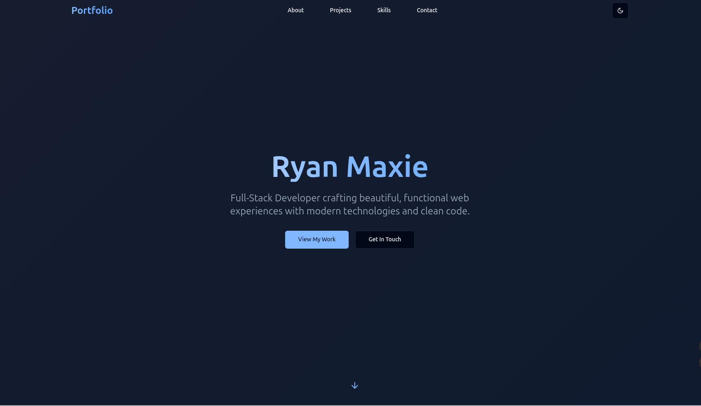
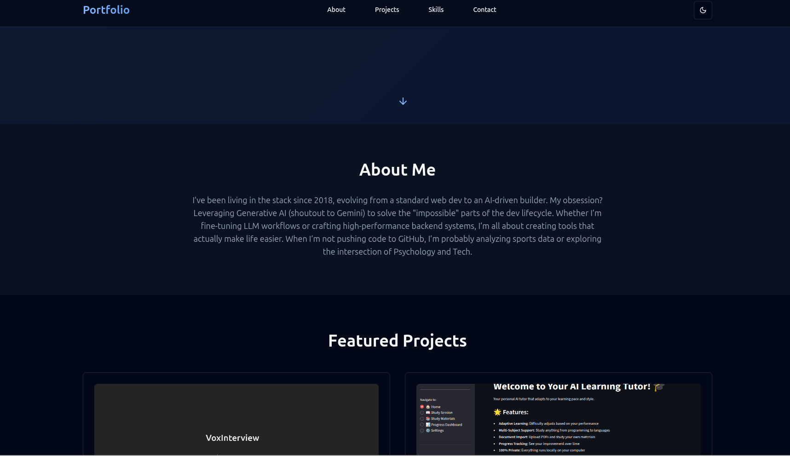
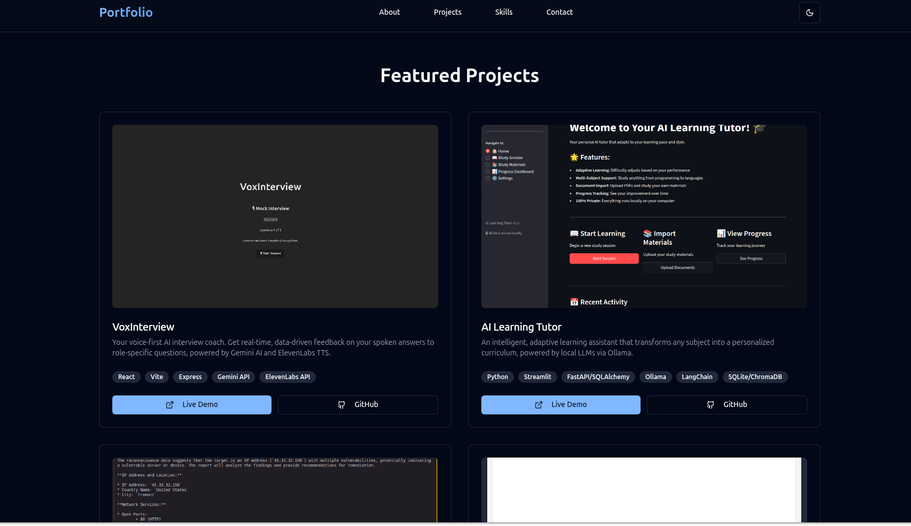
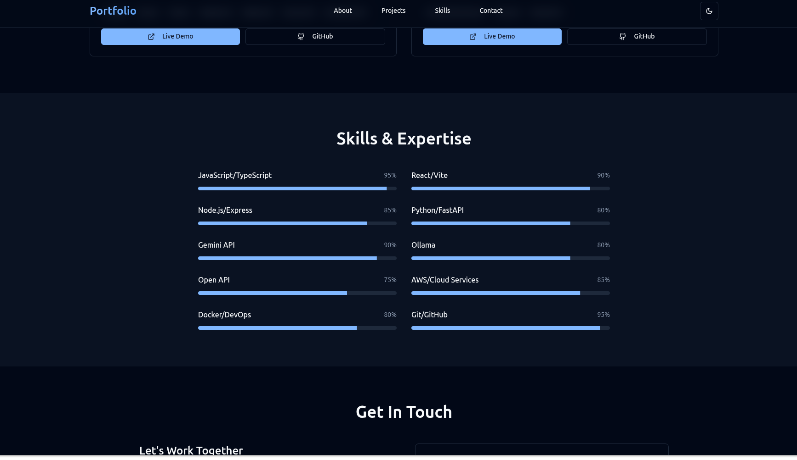

# 🌊 Portfolio: Light Blue

> A modern, responsive, and highly customizable personal portfolio template built with React, TypeScript, and Tailwind CSS, designed for full-stack developers.

[](https://opensource.org/licenses/MIT)
[](http://makeapullrequest.com)
[](https://reactjs.org/)
[](https://www.typescriptlang.org/)
[](https://tailwindcss.com/)

---

## 🧐 What is this?

**Portfolio: Light Blue** is a clean, performance-optimized template for developers who want to showcase their work with a modern aesthetic. It is a single-page application (SPA) built on the **Vite** development server, leveraging the power of **React** and **TypeScript** for a robust and scalable frontend. The design is fully responsive and utilizes **Tailwind CSS** for utility-first styling, complemented by the beautiful, accessible components from **shadcn/ui**.

This template is designed to be a starting point—a boilerplate that you can quickly fork, customize, and deploy to represent your professional brand. It includes all the essential sections: Hero, About, Skills & Expertise, Featured Projects, and a Contact form.

## 🛠️ Tech Stack

This project is a modern, component-driven frontend application.

| Component      | Technology     | Key Libraries/Frameworks                    |
| :------------- | :------------- | :------------------------------------------ |
| **Framework**  | React          | React 18, TypeScript                        |
| **Build Tool** | Vite           | Vite 6.x, @vitejs/plugin-react-swc          |
| **Styling**    | Tailwind CSS   | PostCSS, Autoprefixer, shadcn/ui (Radix UI) |
| **Routing**    | React Router   | `react-router-dom`                          |
| **State/Data** | TanStack Query | `@tanstack/react-query`                     |
| **Icons**      | Lucide         | `lucide-react`                              |

## 🚀 Quick Start

The following instructions are optimized for a Linux environment (**Ubuntu/Debian**) and assume you have a Node.js environment set up.

### Prerequisites

You must have **Node.js (v18 or higher)** and a package manager like **npm** or **pnpm** installed.

1.  **Clone the repository**

    Start by cloning the repository to your local machine and navigating into the project directory.

    ```bash
    git clone https://github.com/RyanMaxiemus/portfolio-light-blue.git
    cd portfolio-light-blue
    ```

2.  **Install Dependencies**

    Install all necessary project dependencies using npm.

    ```bash
    npm install
    ```

3.  **Run the Development Server**

    Launch the local development server. This will typically run on `http://localhost:8080` as configured in `vite.config.ts`.

    ```bash
    npm run dev
    ```

    The application will automatically open in your browser, and changes to the source code will trigger a hot reload.

4.  **Build for Production**

    To create a production-ready build, run the following command. The optimized static files will be placed in the `dist` directory.

    ```bash
    npm run build
    ```

## 📸 Preview






## 🤝 Contributing

Found a bug? Have an idea for a new component, a better way to handle state, or a suggestion for a new feature? We welcome all contributions! This project is a community effort to create the best possible portfolio template.

1.  **Open an Issue:** Before submitting a Pull Request, please open an issue to discuss the bug or feature you're working on. This helps us coordinate and ensures your effort aligns with the project's direction.
2.  **Fork and Branch:** Fork the repository and create a new branch for your contribution. Use a descriptive name like `feat/add-dark-mode` or `fix/contact-form-bug`.
3.  **Code and Commit:** Write clean, well-documented code. Commit messages should be descriptive and follow a conventional format (e.g., `feat: add dark mode toggle`).
4.  **Submit a PR:** Submit a Pull Request against the `main` branch. We'll review it as quickly as possible and appreciate your patience.

Let's make this the go-to portfolio template for modern developers, together.
